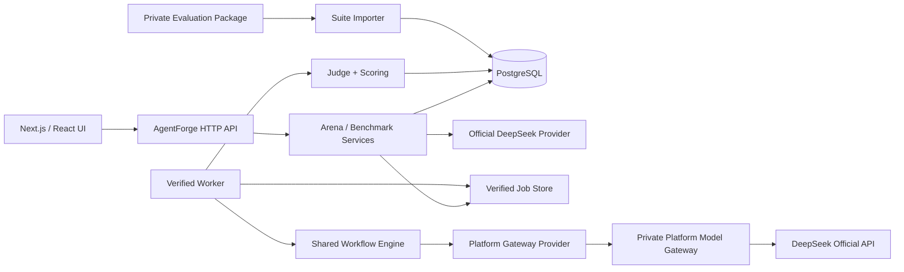

# DeepSeek Official BYOK 与 Verified Benchmark 技术设计

> 2026-09-06 设计对齐：见 [全项目设计地图](../README.md) 与 [评测基础](../evaluation-foundation/README.md)。本文为分期目标，不宣称全量已实现。共享调度/容量/预算采用 Q1–Q25；领域特有授权、证据和原发布 Gate 保留。未来能力不因基础设施设计获批而自动启用。


- 状态：已确认
- 日期：2026-09-05
- 对应需求：[requirements.md](./requirements.md)
- 实施清单：[tasks.md](./tasks.md)
- 相关决策：`docs/adr/0002` 至 `docs/adr/0007`

> 官方能力核对基线（2026-09-05）：DeepSeek [API Quick Start](https://api-docs.deepseek.com/) 将 OpenAI 格式 Base URL 列为 `https://api.deepseek.com`，并列出 `deepseek-v4-flash`；[Models API](https://api-docs.deepseek.com/api/list-models/) 只提供当前可用模型的基础元数据；[Models & Pricing](https://api-docs.deepseek.com/quick_start/pricing) 明确价格可能变化。它们是 Phase 0 必须重新核对并留存快照的来源，不构成上游模型权重不可变证明。

## 1. 当前实现差距

| 当前实现 | 目标 |
| --- | --- |
| `PROVIDER_ALLOWED_HOSTS` 接受管理员允许的任意兼容网关 | 代码级 Official Provider Registry；普通用户无 Base URL 输入 |
| Credential 保存 `baseUrl + modelId + user price` | Official Credential 保存 Provider 身份和加密 Key；模型/标准价格由 Registry/Profile 决定 |
| `Tier = demo / byok / verified` | 明确的 Trust Lane 与 Legacy Provenance |
| Platform 仅配置 Gateway Key 和 Model | 版本化 Gateway Config、测试、激活、回滚和审计 |
| Run/Submission 只记录 tier/model | 记录 Profile、Season、Suite、Scoring、Receipt 和两类 Cost |
| Hidden Run 在当前 HTTP 请求中执行 | Verified 使用持久化 Job 和独立 Worker |
| 排行榜按 Build 去重并保留最好 Submission | Build 取最新完成结果，User 取最高候选 |
| `schema.sql` 无版本迁移台账 | 先建立版本化、可重复执行的升级机制 |
| 静态 hidden fixtures 位于源码 | 生产 Evaluation Suite 从私有资产导入 |
| 无 Role/Credit/Budget/Audit 数据模型 | 新增显式领域服务和持久化模型 |

## 2. 目标架构



### 所有权边界

**AgentForge 拥有：**

- User、Role、Build、Workflow 和不可变 Version。
- Challenge、Evaluation Suite、Run、Judge、Score 和 Leaderboard。
- Benchmark Profile 和 Season 的产品定义。
- Verification Ticket、Budget Policy、Audit Event 和 Consent。
- Receipt 验证、Benchmark Cost 和 Submission Provenance。

**Platform Gateway 拥有：**

- AgentForge 服务身份验证。
- Profile Alias 到 DeepSeek 上游模型的映射。
- 上游 DeepSeek Key。
- 请求幂等、调用限制和 Actual Spend 计量。
- 上游模型调用与脱敏协议错误。

**Platform Gateway 不拥有：**

- 完整 Workflow。
- 隐藏 Evaluation Suite。
- Expected Answer。
- Judge、Score 或 Leaderboard 写入权限。

## 3. 运行模式

### 3.1 Demo

保持现有模拟 Provider。Demo 仅在 Next.js 的 APP_ENV=test 且 DEMO_MODE=true 时启用，必须显示模拟标识。

### 3.2 Official BYOK

- 首版 Provider：`deepseek`。
- 官方 Base URL：`https://api.deepseek.com`。
- 首版 Model：`deepseek-v4-flash`。
- thinking disabled。
- 使用 User Credential。
- 可运行 Public；只有 Profile/Season 与 Provenance Schema 就绪后才开放 Hidden，并进入独立 Official BYOK Leaderboard。
- 不产生 Verified 标识，不消耗 Verification Ticket。

实现时必须再次核对 DeepSeek 官方文档；Provider Registry 中的模型和能力是版本化源码，不通过用户输入扩展。

### 3.3 Custom Endpoint

- 仅 Developer/Admin。
- 仅 Public Run。
- 不创建 Submission、声望或排行榜记录。
- 继续使用 SSRF/DNS/redirect/response-size 防护。
- 与 Official Provider Registry 使用不同的数据和 UI 路径。

### 3.4 Verified

- 使用 Active Benchmark Season。
- Season 解析到 Active Profile、Suite、Scoring Version 和 Gateway Config。
- 创建持久化 Job，不依赖浏览器连接。
- Profile 强制模型参数。
- 每次模型调用验证 Receipt。
- 完整结束后原子写入 Submission 并结算 Ticket。
- MVP 单轮；正式版本三轮中位数。

## 4. Provider Registry

建议新增：

```text
src/lib/ai/provider-registry.ts
src/lib/ai/deepseek-provider.ts
src/lib/ai/platform-gateway-provider.ts
src/lib/ai/execution-receipt.ts
```

Registry 是代码控制的只读定义：

```ts
interface OfficialProviderDefinition {
  id: 'deepseek';
  officialBaseUrl: string;
  allowedModels: Record<string, {
    thinking: readonly boolean[];
    supportsTools: boolean;
    supportsJson: boolean;
    maxOutputTokens: number;
  }>;
}
```

首版只注册：

```text
provider: deepseek
base URL: https://api.deepseek.com
model: deepseek-v4-flash
thinking: false
```

普通 Credential API 接收：

```json
{
  "name": "My DeepSeek",
  "providerId": "deepseek",
  "apiKey": "***"
}
```

不再接收：

```text
baseUrl
modelId
inputPrice
outputPrice
```

Credential 保存前调用官方 `/models` 做认证和可用性验证；失败信息必须经过固定错误映射，不能回传上游原文或 Header。

## 5. Gateway HTTP 合约

### 5.1 能力发现

```http
GET /v1/agentforge/capabilities
Authorization: Bearer <token>
X-AgentForge-Timestamp: <unix-ms>
X-AgentForge-Request-Id: <uuid>
```

返回：

```json
{
  "protocolVersion": "1",
  "gatewayConfigVersion": "gw-2026-001",
  "profiles": ["verified/deepseek-v4-flash-nonthinking-v1"],
  "supportsIdempotency": true,
  "supportsResponseReplay": false,
  "storesRawPrompts": false
}
```

### 5.2 模型调用

```http
POST /v1/chat/completions
Authorization: Bearer <token>
X-AgentForge-Timestamp: <unix-ms>
X-AgentForge-Request-Id: <uuid>
X-AgentForge-Profile: <profile-key>
X-AgentForge-Idempotency-Key: <stable-key>
Content-Type: application/json
```

请求使用受限 OpenAI-compatible 结构。`model` 是平台 Profile Alias，不是真实上游 Model ID。Gateway 必须拒绝未知 alias、冲突参数和 thinking 开启请求。

幂等键建议由以下不可逆摘要生成：

```text
runId + caseId + nodeId + invocationIndex + profileVersion + replicaIndex
```

原始隐藏 Prompt 不得进入幂等键或日志。Gateway 应拒绝超出短时钟偏差窗口的 Timestamp，并保证 Request ID 在窗口内唯一；这些字段只提供新鲜度、关联和重放抑制，Bearer 泄漏后的请求完整性仍需生产阶段用 HMAC 或 mTLS 加固。

### 5.3 Receipt

标准响应外增加 `agentforge`：

```json
{
  "id": "gateway-request-id",
  "model": "verified/deepseek-v4-flash-nonthinking-v1",
  "choices": [],
  "usage": {
    "prompt_tokens": 100,
    "completion_tokens": 50,
    "reasoning_tokens": 0,
    "prompt_cache_hit_tokens": 0,
    "prompt_cache_miss_tokens": 100
  },
  "agentforge": {
    "protocol_version": "1",
    "idempotency_key_hash": "sha256:...",
    "profile_version": "bp-2026-001",
    "gateway_config_version": "gw-2026-001",
    "upstream_provider": "deepseek",
    "upstream_model": "deepseek-v4-flash",
    "thinking_enabled": false,
    "actual_cost_usd": 0.0001,
    "upstream_latency_ms": 740
  }
}
```

AgentForge 必须严格验证：

- Request ID、Idempotency Key 摘要和调用上下文的对应关系。
- Profile/Gateway Config Version。
- Upstream Provider/Model。
- thinking 为 false。
- usage 为非负安全整数。
- reasoning token 为 0 或缺失。
- latency/Actual Spend 为有限非负数。
- 响应体大小和超时。

Receipt 不匹配时，Verified Job 失败；同一 Active Config 的连续协议错误达到三次时暂停 Config，一次有效 Receipt 重置连续计数。

### 5.4 隐私优先的幂等语义

Gateway 对每个 Idempotency Key 保存状态、请求摘要、Receipt、usage 和 Spend，但不保存或重放完整 Prompt、完整响应正文或 choices。

- 首次请求可从 `pending` 进入 `completed` 或 `failed`，且最多调用一次上游。
- 重复请求命中 `pending` 时可等待同一进行中结果，但不得启动第二次上游调用。
- 重复请求命中终态时只返回既有状态和 Receipt 元数据，不返回模型正文。
- 如果 DeepSeek 已完成，但 AgentForge 在持久接收规范化输出前丢失连接，Reconciler 将该调用判为已产生费用但结果不可恢复；整个 Verified Job 进入 `failed_chargeable`，不产生 Submission，也不重复请求上游。

这是“不持久化完整响应”与“避免重复付费调用”之间的明确取舍；MVP 不承诺跨网络故障的 exactly-once 模型结果交付。

## 6. 持久化 Job 与事务

当前 `POST /runs` 返回 NDJSON，并在 `ReadableStream.cancel()` 后中止 Run。Verified 不能复用这一生命周期。

### 6.1 API

```http
POST /api/arena/verified-submissions
→ 202 Accepted
{
  "runId": "...",
  "jobId": "...",
  "status": "queued"
}
```

```http
GET /api/arena/runs/:runId
→ queued | running | completed | failed | paused
```

当前代码仍使用请求绑定 NDJSON；目标由 evaluation-foundation 统一将 Public/Official BYOK/Verified 改为异步创建和状态查询，首版轮询。事件流可后补，不因浏览器断开取消作业；接口修改须同步前端与测试。

### 6.2 创建事务

在 Serializable Transaction 中：

1. 验证 User、Role、Consent 和 Rate Limit。
2. 读取 Build 并冻结精确 Build Version。
3. 解析 Active Season/Profile/Suite/Scoring/Gateway Config。
4. 检查每日次数、并发 Job 和平台 Budget Fuse。
5. 按最早过期选择 Ticket Grant。
6. 创建 Credit Reservation。
7. 创建 Run 和 Verified Job。
8. 提交事务，返回 202。

任何一步失败都不得调用 Gateway。

### 6.3 Worker

建议为 Full Runtime 增加独立长期运行 Worker，而不是 Next.js 请求中的 fire-and-forget Promise：

```text
scripts/verified-worker.ts
src/server/verified/worker.ts
src/server/verified/job-store.ts
```

BullMQ 负责投递和调度；Worker 在 PostgreSQL 原子验证业务执行资格、租约代次和终态，防止旧执行者写回。不要独立再建 Verified 数据库消费队列，也不要用通用 CRUD 在应用内模拟竞争锁。Outbox 领取可使用数据库原子 Claim。

部署约束：如果主站部署在不能运行长期进程的平台，必须为 Worker 提供独立 Node 容器/进程；不能声称纯 Serverless 请求可以保证浏览器断开后的执行。

### 6.4 终态

- `completed`：写 Run Cases、Submission、Receipt/Spend，结算 Ticket。
- `failed_refundable`：无有效上游结果，退款 Ticket，无 Submission。
- `failed_chargeable`：已产生上游结果或 Workflow 自身失败，结算 Ticket，无 Submission。
- `paused`：系统恢复前不可继续，Ticket 保持 Reservation；超过恢复 SLA 后由 Reconciler 根据证据退款或结算。

增加 Reconciler：

- 扫描租约过期 Job。
- 查询 Gateway Idempotency 状态；只有尚未开始上游调用的状态可安全继续，已完成但正文丢失的调用进入 `failed_chargeable`。
- 修复孤立 Reservation。
- 保证一个 Run 最多一个 Submission、一次 Ticket Settlement。

## 7. 数据模型

以下是建议的逻辑表；实现时同时维护 `src/db/schema.ts`、`src/db/schema.sql`、Repository 类型和版本迁移。

### 7.1 现有表的增量字段

**provider_credentials**

```text
kind: official_byok | custom | legacy_custom
provider_id: deepseek | null
status: active | disabled | revoked
base_url: 保留；official 行由服务端写入 canonical snapshot
model_id: 兼容期保留，新的 official credential 不以此作为可信模型来源
```

**runs**

```text
trust_lane
provenance_status
profile_id
season_id
evaluation_suite_id
scoring_version
gateway_config_id
consent_version
benchmark_cost
actual_platform_spend
job_id
```

**submissions**

```text
trust_lane
provenance_status
profile_id
season_id
evaluation_suite_id
scoring_version
gateway_config_version
benchmark_cost
replica_count
aggregation_method
```

### 7.2 新表

| 表 | 用途 |
| --- | --- |
| `role_memberships` | User/Developer/Admin 授权、授予人和撤销状态 |
| `access_invitations` | Developer 邀请、有效期和接受状态 |
| `platform_gateway_configs` | 加密 Token、URL、版本、状态和测试结果 |
| `benchmark_profiles` | Provider/Model/参数/能力/冻结价格的不可变版本 |
| `evaluation_suites` | Challenge 的版本化测试集元数据和内容摘要 |
| `benchmark_seasons` | Challenge + Profile + Suite + Scoring 的比赛周期 |
| `evaluation_jobs`（共享基础） | Verified 关联竞技 Run，复用统一作业与 Attempt，不另建 verified_jobs 调度系统 |
| `execution_receipts` | 每个模型调用的脱敏执行证据 |
| `verification_ticket_grants` | 数量、来源、剩余量和到期时间 |
| `verification_ticket_reservations` | Run 级预留、结算或退款 |
| `verification_ticket_events` | 不可修改的 Grant/Reserve/Settle/Refund/Expire/Admin Ledger |
| `platform_spend_events` | Actual Spend 与 Gateway Request 的幂等费用记录 |
| `platform_spend_reservations` | Job 创建前按最坏允许成本占用预算，结算后释放差额 |
| `platform_budget_policies` | 单次、用户每日、全局每日/月度上限 |
| `audit_events` | 敏感管理操作、主体、影响对象和前后版本摘要 |
| `consent_acceptances` | 用户、Consent Kind、Version 和接受时间 |

**test_cases** 增加 `evaluation_suite_id`。生产 hidden cases 不允许通过普通 Repository DTO/Serializer 返回。

### 7.3 约束和索引

至少需要：

- 首版一个 User 跨竞技和作者自测最多一个执行中 EvaluationJob，Verified 不另开可绕过总限额的名额。
- 一个 Idempotency Key Hash 唯一。
- 一个 Run 最多一个 Submission。
- 一个 Run 最多一个 Ticket Reservation。
- 一个 Gateway Request ID / Receipt ID 唯一。
- 同一 Challenge/Profile/Suite/Scoring 同时最多一个 Active Season。
- 同一 Gateway Config Version 唯一。
- 同一 Profile Key + Version 唯一。
- Ticket Event Reference + Event Type 幂等唯一。
- Spend Event Gateway Request ID 唯一。
- 每个 Verified Job 最多一个 Active Spend Reservation；预算检查与 Reservation 创建必须处于同一事务。
- Active Admin 数量不能仅靠 UI 约束；撤销服务必须在事务中检查。

## 8. 数据库迁移策略

当前 `pnpm db:migrate` 已使用 `schema_migrations` 版本台账、checksum 校验和事务级 advisory lock。Gateway 专属业务表仍必须通过新的、经协调的 additive migration 加入，不能改写已应用历史。

### 8.1 已实现：版本化迁移执行器

```text
src/db/migrations/
schema_migrations
scripts/migrate.ts
```

执行器流程：

1. 创建 `schema_migrations`。
2. 获取迁移级 advisory lock。
3. 按版本排序读取 SQL 文件。
4. 每个迁移在事务中执行并写入 checksum。
5. 已应用版本 checksum 不匹配时失败。
6. 重复执行无副作用。

`src/db/schema.sql` 继续表示全新数据库的目标结构；版本 SQL 负责已有数据库升级。不能依赖 `CREATE TABLE IF NOT EXISTS` 补字段。

### 8.2 Gateway 专属迁移批次（设计草案）

以下名称保留为设计标签，不是当前已创建的迁移文件；实施时必须分配新的 canonical 版本并保持既有 checksum 历史不变。

```text
001_versioned_migration_ledger
002_roles_gateway_profiles
003_evaluation_suites_seasons
004_shared_evaluation_link_receipts
005_ticket_and_spend_ledgers
006_add_run_submission_provenance
007_backfill_legacy_credentials_and_submissions
008_constraints_and_indexes
```

全部采用 additive migration。旧 `tier/base_url/model_id/cost` 字段在兼容窗口内保留，不在同一发布删除。

### 8.3 Legacy Backfill

- 旧 `demo` → Demo Provenance。
- 旧 `byok/verified` → Legacy Submission，不进入新榜。
- Base URL 规范化后精确匹配 `api.deepseek.com` 或 `api.deepseek.com/v1` 的 Credential → Official DeepSeek Candidate。
- 其他 Credential → `legacy_custom + disabled`。
- 不解密 Key 做批处理校验；用户首次重新启用 Official Credential 时调用 `/models` 验证。

必须验证：全新库、旧结构升级、重复执行、数据保留和认证注册/登录。

## 9. Benchmark Cost 与 Actual Spend

### Benchmark Cost

- 存储在 Profile 中的冻结价格快照。
- 同一 Season 不变。
- 建议使用明确的 `peak cache-miss input` 与 `peak output` 标准价策略。
- 根据规范化 token usage 计算。
- 用于 Efficiency 和 Cheapest 排行。

### Actual Platform Spend

- 由 Gateway 返回并写入 Spend Event。
- 用于预算、运营和异常检测。
- 不返回普通用户，不参与排序。
- 缺失或非法时 Verified 失败。

不要复用现有单一 `cost` 字段同时表达两种含义。兼容期可以让公开 DTO 的 `cost` 映射为 Benchmark Cost，并增加明确字段名。

## 10. Ticket 与 Budget

### Ticket Grant

默认新用户 Grant：

```text
quantity: 3
eligibility: verified email OR trusted OAuth
expires: 30 days
one-time grant key: onboarding-v1
```

### Reservation State

```text
reserved → settled
reserved → refunded
reserved → expired_reconciled
```

不能直接改用户余额而不写 Ledger Event。

### Budget

两层防护：

1. AgentForge 根据 Profile 的最大 case 数、模型调用次数和 token 上限计算 Worst-Case Spend Reservation；在 Job 创建事务中原子检查“已结算 Spend + Active Reservations”并占用单次、用户每日、全局每日和全局月度预算。
2. Gateway 在调用 DeepSeek 前执行自己的硬预算限制。

Job 结束时以实际 Spend 结算并释放预留差额；退款 Ticket 不等于删除已经发生的 Spend。Reconciler 负责回收无对应 Active Job 的过期 Budget Reservation。

激活前必须显式配置所有金额和警告阈值；代码示例值不能自动成为生产预算。

## 11. 排行榜查询

新查询键：

```text
problemId
trustLane
profileId
seasonId
sort
```

Verified 查询必须要求明确 Active/Historical Season；不能默认跨 Season。

候选算法：

1. 排除 Legacy、Failed、Receipt Invalid。
2. 每个 Build 选择最新 Completed Submission。
3. 每个 User 从其 Build 候选中选择最高分。
4. 应用排序和 tie-breaker。
5. 返回精确 Run、Submission、Build Version 和 Provenance DTO。

Official BYOK 使用独立 Lane，但也应按 Profile/Season 划分，以避免不同模型参数混排。

## 12. Admin Control Plane

建议新增受保护的 Admin API 与页面：

```text
/admin/gateways
/admin/benchmark-profiles
/admin/seasons
/admin/evaluation-suites
/admin/credits
/admin/roles
/admin/budgets
/admin/audit
```

写操作要求：

- Server-side Role Check。
- 最近重新认证。
- CSRF/Origin 防护。
- 输入校验。
- Audit Event。
- 响应不包含 Secret。

Gateway 激活状态：

```text
draft → testing → active → retired
draft/testing/active → disabled
active → paused（自动或人工）
```

生产增强：扩权、预算提高、Profile 激活支持第二 Admin Approval；紧急暂停保持单人操作。

## 13. 隐私与日志

禁止记录：

- API Key、Platform Token、Cookie、连接串密码。
- Gateway 或通用日志中的完整 System/User Prompt。
- 日志、普通 DTO 或错误中的 Hidden Input/Expected/Actual。
- Challenge Secret。
- 上游原始错误体和 Header。

允许记录：

- Request/Receipt ID。
- Profile、Season、Gateway Config Version。
- User surrogate/hash。
- Token counts、latency、status、error category、Actual Spend。
- Idempotency Key Hash。

AgentForge 的受限评测存储可以保存 Workflow 继续执行和 Judge 所需的规范化节点输出，但不得保存上游原始响应封装，且隐藏输出不能进入普通 API、日志或错误。Gateway、反向代理、APM 和错误采集工具都必须关闭 request/response body capture；不能只在应用层避免 `console.log`。

## 14. Canary 与 Season 生命周期

Canary 信号：

- `/models` 基本可用性。
- Profile capability endpoint。
- 固定静态 JSON prompt。
- 固定 Tool Calling prompt。
- Receipt 上游身份变化。
- token/latency 分布异常。

Canary 发现变化：

```text
active → paused
拒绝新 Verified Job
通知 Admin
保留进行中 Job 的证据
```

Admin 确认模型变化后：

1. Close 旧 Season。
2. Retire 旧 Profile Version。
3. 创建并测试新 Profile。
4. 使用新 Suite/Scoring 组合创建 Season。
5. 新旧榜独立展示。

## 15. UI 影响

### Providers

普通用户：

- Provider 下拉仅 DeepSeek。
- API Key 和显示名。
- 不显示 Base URL、任意 Model ID 或自报价格输入。
- 显示 Official Endpoint 和数据发送说明。

Developer/Admin：

- 独立 Advanced Custom Endpoint 区域。
- 明确 Public Tests Only / Unranked。

### Builder

- Model Node 选择 Registry/Profile，而不是自由字符串。
- Verified 执行前显示实际强制参数和 Ticket 消耗。
- Official BYOK 与 Verified Consent 分开。

### Run

- Public/BYOK 可继续 NDJSON。
- Verified 提交返回 queued 页面并轮询状态。
- 页面关闭后重新进入仍能查看进度。
- 失败显示固定分类和退款/结算结果。

### Leaderboard

- Trust Lane、Profile 和 Season 是显式筛选。
- 展示 Profile/Suite/Scoring/冻结价格。
- Legacy Archive 独立入口。
- 每用户一行。

### Admin

- Draft/Test/Activate/Retire 工作流。
- Token 永不回显。
- Budget Fuse、Canary、Audit 和 Credit Grant。

UI 必须同步支持英文和简体中文 System Content，不改变 Canonical Value。

## 16. 单一应用与可测试领域边界

- Portable 已退役；唯一 Next.js 应用通过适配器接入 Verified 能力，独立 Worker 使用服务端组合根。
- 测试用内存仓储和 Fake Gateway 仅用于隔离测试，不代表正式准入或执行证据。
- Core Workflow Engine 继续不依赖 Next.js、数据库或 Gateway 实现。

建议不要继续扩大单体 `ArenaService`；按领域拆分：

```text
src/server/arena-service.ts
src/server/provider-service.ts
src/server/benchmark-service.ts
src/server/verified-submission-service.ts
src/server/credit-service.ts
src/server/admin-service.ts
```

共享引擎通过 Adapter 注入 Provider 和 Receipt Collector。

## 17. 验证策略

### 无付费依赖自动化

- Provider Registry 精确 URL/Model。
- 普通用户不能提交 Base URL。
- Custom Endpoint 权限和 Hidden 禁止。
- Receipt 严格验证和熔断。
- Ticket Reserve/Settle/Refund/Expire 幂等。
- 并发 Job、重复 Idempotency Key 和 Worker 恢复。
- Budget 原子检查。
- Role、最后 Admin、重新认证和 Audit。
- Season/Profile/Suite 排行隔离。
- Build 最新 + User 最高算法。
- Legacy Backfill。
- Hidden DTO/错误路径不泄露。
- 普通应用未配置 Provider 时拒绝运行，不回退模拟模型。

### PostgreSQL

- 全新 Schema。
- 旧 Schema 升级。
- 重复迁移。
- 数据保留。
- Serializable 并发和 Worker Claim。
- Ticket 与 Submission 事务故障注入。
- Better Auth 注册/登录和 Bootstrap Admin。

### Fake Gateway

- 成功 Receipt。
- Token 拒绝。
- Request ID/Profile/Model 不匹配。
- 幂等重放。
- 超时、429、5xx、超大响应。
- 部分调用成功后失败。
- Actual Spend 缺失/非法。
- Canary 变化与三次协议错误暂停。

### 手工/Staging

- 使用隔离的低额度 DeepSeek Key。
- `/models` 凭据验证。
- JSON、Tool Calling、usage 和非思考模式。
- Token 轮换、Gateway 回滚和预算熔断。
- Desktop/Narrow React UI。
- 浏览器断开、进程重启、Worker 恢复。

真实 DeepSeek 调用是付费集成测试，不进入默认 CI，执行前需要明确授权和成本上限。

## 18. 发布与回滚

### 发布顺序

1. 迁移基础设施。
2. Additive Schema。
3. 新代码双读、旧 UI 保持可用。
4. Official Provider Registry 和新 Credential UI。
5. Legacy Backfill 与新 Leaderboard 隔离。
6. Internal Gateway/Admin/Credit/Profile 功能，Feature Flag 关闭。
7. 私有 Gateway Staging。
8. Internal Preview。
9. Verified Beta 单轮最新成绩。
10. 正式三轮中位数新 Season。

### Feature Flags

```text
OFFICIAL_DEEPSEEK_BYOK_ENABLED
CUSTOM_ENDPOINTS_ENABLED
VERIFIED_BENCHMARK_ENABLED
VERIFIED_PUBLIC_SIGNUP_ENABLED
VERIFIED_THREE_REPLICA_ENABLED
```

### 回滚

- 代码回滚不得回滚或删除已产生 Ledger/Receipt/Submission 数据。
- 遇到问题优先关闭 Feature Flag、暂停 Gateway/Profile/Season。
- Additive Schema 保留，后续兼容性修复。
- Token 泄漏先在 Gateway/DeepSeek 撤销轮换，再处理应用配置。
