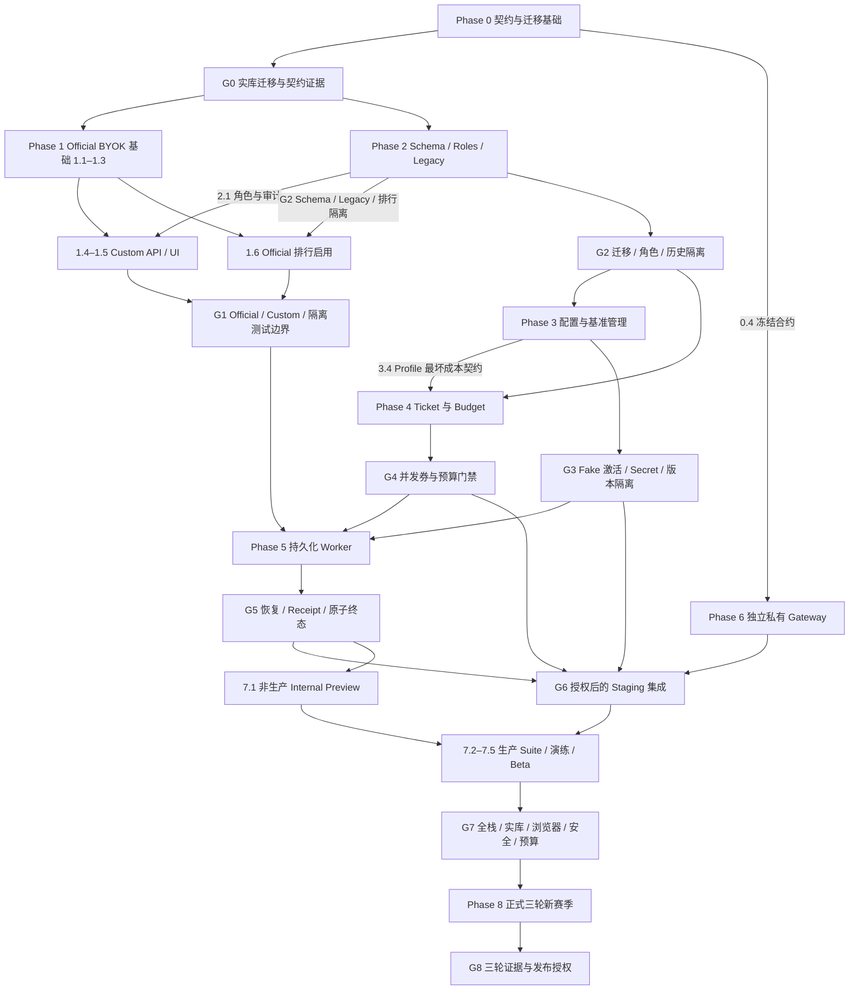

# DeepSeek Official BYOK 与 Verified Benchmark 实施计划

> 2026-09-06 设计对齐：见 [全项目设计地图](../README.md) 与 [评测基础](../evaluation-foundation/README.md)。本文为分期目标，不宣称全量已实现。共享调度/容量/预算采用 Q1–Q25；领域特有授权、证据和原发布 Gate 保留。未来能力不因基础设施设计获批而自动启用。

- 状态：实施中；首批基础代码已落地，Phase 0 实库 Gate 已验证，后续阶段待实施
- 日期：2026-09-05
- 需求：[requirements.md](./requirements.md)
- 设计：[design.md](./design.md)
- 架构决策：`docs/adr/0002` 至 `docs/adr/0007`

> 本清单不授权真实模型费用、生产数据库写入、部署、提交或推送。每个阶段应独立评审和验证，不建议作为一个超大 PR 一次完成。

## 交付路线与依赖摘要

以下是交付依赖，不是完成记录；Phase 编号保留原有范围，不代表必须整阶段顺序实现。`G0`–`G8` 分别指下文对应 Phase Gate，只有实际证据齐备才能勾选。契约、Fake Gateway 和关闭 Feature Flag 的代码可先行开发，但不能据此越过数据库、权限或真实集成门禁。

> 2026-09-06 实施边界：当前工作树交付 Phase 0 基础代码与 1.2 独立 Registry；5.3 仅先行实现 Receipt 校验器。其余业务阶段尚未交付。本地 Docker/PostgreSQL 已配置，实库迁移矩阵和认证冒烟通过；后续业务阶段未完成，因此仍不开放新的 Ranked Hidden/Verified 流程。勾选任务表示该代码交付项已实现，不代表对应 Phase Gate 全部通过。证据见 `docs/verification/deepseek-gateway-phase0-2026-09-06.md`。

- **跨阶段权限依赖**：1.4 的 Custom API 和 1.5 的 Custom UI 必须依赖 2.1 的服务端 Membership/权限校验，不能先以 UI 隐藏代替授权。Official-only UI 可先行，但 Custom 入口不得提前启用。3.2、3.4–3.6、4.5 的管理操作同样依赖 2.1 的角色、重认证和审计。
- **排行榜依赖**：1.6 的身份契约可先定义；Ranked Hidden Submission 启用须等待 2.2–2.5 和 G2，此前仅连接测试/Public Run。G1 的边界验证不等于已授权开放 Hidden 或 Verified。
- **事务依赖**：5.2 的可用交付依赖 2.2–2.3、3.2/3.4–3.6、4.1–4.4 和 5.1；5.4–5.5 依赖 5.3、券/预算结算及状态查询契约。不能以空实现代替预留、对账或失败关闭。
- **私有交付边界**：Phase 6 的真实 Gateway 实现、生产配置、Secret 与部署属于独立私有项目，不进入公开 AgentForge 仓库；公开仓库仅包含合约、客户端/验证器和 Fake Gateway。0.4 冻结后可并行开发私有实现，但 G6 必须等待应用侧 G3–G5 的集成能力，不能用 Fake 验证替代。
- **发布门禁**：7.1 可在非生产 Suite 与 Fake Gateway 下做 Internal Preview；7.5 公开 Beta 开放前必须完成 G0–G6、7.2–7.4 及 G7 全部检查，并由运营者填写真实预算。正式认证另须 G8，不把单轮 Beta 升格或混入三轮榜。
- **授权门禁**：任何真实付费调用（包括激活、Canary、Staging、故障演练）均须事先明确授权及成本上限，不进入默认 CI；部署、生产数据库写入另需对应授权。未获授权应记录未验证/阻塞，不以模拟结果勾选真实集成 Gate。

## 需求到交付任务追踪

下表为原有任务的验收归属补充，不增加或重定义需求。任务 ID 的整数部分即 Phase；关联多个阶段的需求必须联合验收，不能因其中一个 PR 合并就标记整条需求完成。

| 需求 | 对应 Phase / 任务 ID | 联合验收门禁与重点 |
| --- | --- | --- |
| R1 官方 Registry | 0.1；1.2–1.5；7.3 | G0、G1、G7：官方来源、服务端允许列表、无用户 Base URL |
| R2 凭据隔离 | 1.3–1.4；3.1–3.2；6.2 | G1、G3、G6：认证加密、用户隔离、掩码、Fork 清引用、Token 不回显 |
| R3 Trust Lane | 1.1、1.4、1.6；2.3–2.5 | G1、G2：Demo/BYOK/Custom/Verified/Legacy 隔离，Custom 仅 Public |
| R4 Profile | 0.1；1.2；2.2；3.4；5.4；6.3 | G0、G3、G5、G6：不可变版本、强制参数与冻结价格 |
| R5 Season | 2.2；3.6；6.6；8.2 | G3、G6、G8：Canary 暂停、Admin 确认关闭、新版本新赛季 |
| R6 Gateway 配置 | 0.4；2.2；3.1–3.3；5.3；6.1–6.2、6.6；7.2 | G3、G5–G7：测试后激活、原子退役、连续协议错误暂停与有效 Receipt 重置 |
| R7 Receipt | 0.4；3.3；5.3–5.4；6.3–6.4；7.2 | G0、G3、G5–G7：严格字段/身份验证，不估算，失败无 Submission |
| R8 持久化 Job | 4.3；5.1–5.2、5.4–5.6；7.2 | G4、G5、G7：断连/崩溃恢复、正文丢失失败关闭、原子终态 |
| R9 认证券 | 4.1–4.3、4.5；5.2、5.5；7.2 | G4、G5、G7：一次性赠券、FIFO、幂等预留/结算/退款与有效期 |
| R10 频率与预算 | 4.4–4.5；5.2、5.4–5.5；6.4–6.5；7.2、7.5 | G4–G7：每日/同版本/并发限制、原子最坏成本预留、双层硬预算、不回退 |
| R11 角色与审计 | 2.1；1.4–1.5；3.2、3.4–3.6；4.5；7.3 | G1–G4、G7：Bootstrap、最后 Admin、服务端授权、重认证与不可变审计 |
| R12 私有评测集 | 2.2；3.5；7.1、7.4 | G3、G7：版本化私有导入、Hidden DTO/错误不泄露、非生产 fixtures 不作认证 |
| R13 排行榜 | 1.6；2.3、2.5；7.5；8.1–8.2 | G2、G7、G8：精确身份、Build 最新/User 最高、完整 tie-breaker、三轮隔离 |
| R14 Consent | 1.5；5.2、5.6；7.3 | G1、G5、G7：BYOK/Verified 分别版本化确认、参数透明、不公开 Actual Spend |
| R15 Legacy | 0.2–0.3；1.1；2.3–2.5 | G0、G2：新库/升级/重跑/保留、所有权不变、旧结果不升级 |
| R16 单一应用/隔离测试 | 1.1；Phase 1 Gate；横切质量门禁 | G1、G7：核心独立可测，普通应用不回退 Demo |
| R17 隐私与保留 | 1.3；3.1–3.3、3.5；4.1；5.3；6.1、6.4–6.5 | G3–G7 与横切门禁：关闭 Body Capture、受控输出、Receipt/错误/Audit/Ledger 保留期、退役 Token 不可用 |
| R18 阶段发布 | 0.2；7.1–7.5；8.1–8.3 | G0–G8：Preview/Beta/正式分开、授权与真实证据、未验证项显式记录 |

## Phase 0：冻结契约与建立迁移基础

- [x] 0.1 确认 DeepSeek 当前官方 Base URL、模型 ID、thinking、JSON、Tool Calling 和 usage 字段
  - 将核对日期、官方来源和允许能力记录到 Provider Registry 文档。
  - 如果 `deepseek-v4-flash` 或能力已变化，先更新 Profile 方案，不带过期假设进入代码。
  - _Requirements: R1, R4_

- [x] 0.2 为 PostgreSQL 建立版本迁移台账
  - 新增 `schema_migrations`、checksum、迁移锁和顺序执行。
  - 保持 `src/db/schema.sql` 作为全新库目标结构。
  - 不依赖 `drizzle/` 生成产物自动应用。
  - _Requirements: R15, R18_

- [x] 0.3 添加旧数据库基线 fixtures
  - 覆盖旧 `provider_credentials`、runs/submissions、缺少新列和认证账号。
  - 为全新、升级、重复执行和数据保留测试准备独立数据库。
  - _Requirements: R15_

- [x] 0.4 定义 Gateway Contract 包
  - 添加请求 Header、Capabilities、Completion、Receipt 和错误码的严格 TypeScript/Zod 契约。
  - 契约不依赖 Next.js，并可复制/发布给私有 Gateway 项目。
  - _Requirements: R6, R7_

**Phase 0 Gate**

> 基础测试、类型检查与构建通过；实库迁移矩阵及全栈认证冒烟已通过，G0 证据已补齐。不能据此宣布 Phase 1–8 完成或生产上线验收；窄屏 UI 仍有缺陷。

- [x] Migration runner 在空库和旧库可重复运行（2026-09-06 实库矩阵通过，包含并发、回滚与数据保留）。
- [x] Gateway contract 有正反例单元测试（本次 22 项，包括 Zod；全部通过）。
- [x] 尚未改变现有用户行为（新增 Registry/Contract 未接入 API；保留现有业务回归）。

## Phase 1：Trust Lane 与 Official DeepSeek BYOK

- [ ] 1.1 重构共享类型
  - 将 `Tier` 演进为明确 Trust Lane/Provenance 类型。
  - 为 Run/Submission DTO 增加 Profile/Season/Suite/Scoring 字段。
  - 保持核心测试可解析的 `.ts` 相对导入。
  - _Requirements: R3, R15, R16_

- [x] 1.2 实现 Official Provider Registry
  - 新增 DeepSeek canonical endpoint 和首版唯一模型定义。
  - 实现服务端模型/能力解析，禁止普通用户提供 Base URL 和价格。
  - _Requirements: R1, R4_

- [ ] 1.3 实现 Official DeepSeek Provider
  - 2026-09-06 部分完成：现有 BYOK SDK 已接 Registry、显式非 thinking、usage 校验；4 用例真实公开 Run 通过。保存前 `/models` 校验与 API 分离尚未完成，不勾选整项。证据：`docs/verification/deepseek-app-live-2026-09-06.md`。
  - 复用安全 Fetch 的 DNS、IP、redirect、timeout 和 response-size 防护。
  - Credential 保存时通过官方 `/models` 验证 Key。
  - 固定错误映射，不泄漏上游原始响应。
  - _Requirements: R1, R2, R17_

- [ ] 1.4 拆分 Official 和 Custom Credential API
  - 普通 User 只能创建 Official DeepSeek Credential。
  - Developer/Admin 的 Custom Endpoint 使用独立路由和权限。
  - Custom 禁止 Hidden、Submission、Reputation 和 Leaderboard。
  - _Requirements: R2, R3, R11_

- [ ] 1.5 更新 Provider/Builder UI
  - 删除普通用户 Base URL、自由 Model ID 和自报价格字段。
  - 增加 Official BYOK Consent 和 Registry Model 展示。
  - Custom 区域明确 Public Only / Unranked。
  - 同步英文和简体中文 System Content。
  - _Requirements: R1, R14_

- [ ] 1.6 建立新 Official BYOK Leaderboard Identity 契约
  - 按 Profile/Season 隔离，即使首版只有一个 Profile。
  - 不与 Demo、Legacy 或 Verified 混排。
  - Phase 2 的 Profile/Season Schema 和迁移完成前，只开放连接测试与 Public Run，不激活新的 Ranked Hidden Submission。
  - _Requirements: R3, R13_

**Phase 1 Gate**

- [ ] 普通用户无法通过 API 或 UI提交任意 Base URL。
- [ ] Developer Custom Endpoint 无法接触 Hidden。
- [ ] Official BYOK 不被标记为 Verified。
- [ ] 模拟模型仅在显式隔离测试模式启用。

## Phase 2：Additive Schema、角色与 Legacy 迁移

- [ ] 2.1 添加 Role/Invitation/Audit 表和服务
  - User 为默认权限，Developer/Admin 为显式 Membership。
  - Bootstrap Admin Email 幂等授予。
  - 禁止撤销最后一个 Admin。
  - _Requirements: R11_

- [ ] 2.2 添加 Profile/Suite/Season/Gateway Config 表
  - Profile、Suite 和 Config 使用不可变版本。
  - Season 精确绑定 Challenge/Profile/Suite/Scoring。
  - _Requirements: R4, R5, R6, R12_

- [ ] 2.3 添加 Run/Submission Provenance 字段
  - Additive columns，旧字段保留兼容。
  - 新写入同时记录新旧兼容字段，读取优先新 Provenance。
  - _Requirements: R3, R13, R15_

- [ ] 2.4 执行 Legacy Backfill
  - 旧 Demo 保留模拟历史。
  - 旧 BYOK/Verified 标为 Legacy Archive。
  - 精确 DeepSeek Base URL 标记为 Official Candidate，其余 Disabled Legacy Custom。
  - 生成迁移报告，不输出密钥。
  - _Requirements: R15_

- [ ] 2.5 更新排行榜
  - Build 使用最新 Completed Submission。
  - User 使用最高候选 Build。
  - 实现完整 tie-breaker。
  - 增加 Legacy Archive 入口。
  - _Requirements: R13, R15_

**Phase 2 Gate**

- [ ] 新库、旧库、重复迁移和数据保留全部通过。
- [ ] 旧成绩无法出现在新榜。
- [ ] 角色 API 有跨用户、越权和最后 Admin 测试。

## Phase 3：Gateway 配置、Profile 与 Season 管理

- [ ] 3.1 为 Platform Token 增加独立加密域
  - AAD 绑定 Gateway Config ID 和 Secret Kind。
  - Token 只可写入/轮换，不能读取明文。
  - _Requirements: R2, R6_

- [ ] 3.2 实现 Gateway Config 生命周期
  - Draft/Test/Active/Retired/Disabled/Paused。
  - 新配置激活原子退役旧配置。
  - 记录重认证和 Audit Event。
  - _Requirements: R6, R11_

- [ ] 3.3 实现激活测试套件
  - 网络安全、Capabilities、未知 Profile、Receipt、JSON、Tool、幂等、隐私错误。
  - 生产禁用跳过验证。
  - _Requirements: R6, R7, R17_

- [ ] 3.4 实现 Benchmark Profile 管理
  - 首版固定 `deepseek-v4-flash` non-thinking、temperature 0、non-streaming、no retry。
  - 冻结 Benchmark Price Source 和数值。
  - _Requirements: R4_

- [ ] 3.5 实现 Evaluation Suite 导入器
  - 私有资产导入、版本、checksum、case counts。
  - 普通 API 和日志禁止输出 Hidden 内容。
  - _Requirements: R12, R17_

- [ ] 3.6 实现 Season 生命周期与 Canary 状态
  - Open/Pause/Resume/Close。
  - Canary 只暂停和告警；Admin 确认后关闭。
  - _Requirements: R5_

**Phase 3 Gate**

- [ ] Fake Gateway 可完成完整激活检查。
- [ ] Token 从未出现在 DTO、日志或错误中。
- [ ] Profile/Suite/Season 变更不能污染既有 Submission。

## Phase 4：Verification Ticket 与 Budget

- [ ] 4.1 添加 Ticket Grant/Reservation/Event 表
  - 支持 30 天 Onboarding Grant、FIFO、24h 最低退款有效期。
  - Ledger Event 不可修改。
  - _Requirements: R9, R17_

- [ ] 4.2 实现新用户 Grant
  - Verified Email 或 Trusted OAuth 后一次性发 3 张。
  - 使用稳定 Grant Key 防重复。
  - _Requirements: R9_

- [ ] 4.3 实现 Reserve/Settle/Refund Matrix
  - 每个 Run 唯一 Reservation。
  - 幂等重放最多结算一次。
  - 覆盖用户取消、平台失败、模型低分、Workflow 超预算和数据库失败。
  - _Requirements: R8, R9_

- [ ] 4.4 添加 Spend Event、Budget Reservation 和 Budget Policy
  - Actual Spend 幂等写入。
  - 在 Job 创建事务中按 Profile 最坏成本原子预留单次、用户每日、全局每日/月度预算。
  - 结算 Actual Spend、释放差额，并由 Reconciler 回收孤立预留。
  - 警告阈值可配置，100% 暂停。
  - 激活前金额和警告阈值必填。
  - _Requirements: R10_

- [ ] 4.5 增加 Admin Credit/Budget UI
  - 发放、补偿、到期信息和 Audit。
  - 提高预算要求重新认证；紧急降低/暂停立即生效。
  - _Requirements: R9, R10, R11_

**Phase 4 Gate**

- [ ] 并发 Reserve 不会透支同一 Ticket。
- [ ] 相同 Idempotency Key 不重复扣券或记账。
- [ ] Budget Race 不允许“已结算 Spend + Active Reservations”超过硬上限后继续创建新 Job。

## Phase 5：持久化 Verified Worker

- [ ] 5.1 接入 evaluation-foundation 的公共 Job/Attempt 服务
  - 共用状态、lease、attempt、heartbeat；Verified 特有 Receipt/Ticket/Season 校验独立实现。
  - BullMQ 调度，PostgreSQL 权威状态及执行资格保护；复用 Outbox，不独立建设第二个 PostgreSQL 队列。
  - _Requirements: R8_

- [ ] 5.2 添加 Verified Submission API
  - 在事务中冻结 Build Version、Season/Profile/Suite/Scoring/Config 并预留 Ticket。
  - 返回 `202 + runId + jobId`。
  - _Requirements: R8, R9, R10, R14_

- [ ] 5.3 实现 Platform Gateway Provider 和 Receipt Validator
  - 2026-09-06：Receipt Validator 与调用摘要已先行实现并测试；网络 Provider、超时/读取限制和集成仍待实现。
  - 使用受限 OpenAI-compatible 合约。
  - 生成稳定 Idempotency Key。
  - 严格验证 Receipt，禁止估算。
  - _Requirements: R7, R17_

- [ ] 5.4 实现 Worker 执行
  - 加载精确 Version 和 Suite。
  - 复用 Shared Workflow Engine/Judge/Scoring。
  - 收集每次调用 Receipt。
  - 写 Benchmark Cost 与 Actual Spend。
  - _Requirements: R4, R7, R8_

- [ ] 5.5 实现 Reconciler
  - 核对租约过期 Job；未调用前可安全恢复，已调用中断不盲目重新执行。
  - 修复孤立 Ticket Reservation。
  - 查询同一 Gateway Idempotency Key 的状态；已完成但正文丢失时失败关闭为 `failed_chargeable`，不得重复上游调用。
  - 保证一个 Run 最多一个 Submission。
  - _Requirements: R8, R9_

- [ ] 5.6 更新 Run UI
  - Verified 使用 queued/running 状态页和轮询。
  - 浏览器断开后重新打开仍可查看。
  - 显示退款/结算、Profile 和 Provenance。
  - _Requirements: R8, R14_

**Phase 5 Gate**

- [ ] 浏览器断开不终止 Verified Job。
- [ ] Worker 中断后状态可收敛；已知结果可幂等收尾，未知付费调用不可自动重发。
- [ ] Receipt 不匹配自动失败，连续三次暂停 Config。
- [ ] 任何失败路径都没有部分 Submission。

## Phase 6：私有 Platform Model Gateway 项目

- [ ] 6.1 创建独立私有项目和部署
  - 使用独立 Secret、日志和预算边界。
  - AgentForge 仓库只保存合约和 Fake Gateway。
  - _Requirements: R6, R17_

- [ ] 6.2 实现服务认证与 Token 轮换
  - MVP Bearer + timestamp + request ID + idempotency。
  - 支持新旧 Token 短暂重叠和旧 Token 立即撤销。
  - 生产路线预留 HMAC/mTLS。
  - _Requirements: R6_

- [ ] 6.3 实现 Profile Alias 与 DeepSeek Adapter
  - 拒绝真实模型直传和冲突参数。
  - 固定 non-thinking/temperature 0。
  - _Requirements: R4, R7_

- [ ] 6.4 实现隐私优先的 Idempotency/Usage/Spend
  - 同一 Key 最多调用一次上游；进行中重复请求复用同一执行。
  - 终态只重放状态与 Receipt 元数据，不持久化或重放完整模型正文。
  - AgentForge 未持久接收正文时按 `failed_chargeable` 失败关闭。
  - 返回完整脱敏 Receipt。
  - _Requirements: R7, R10_

- [ ] 6.5 实现 Gateway Budget Fuse 和日志脱敏
  - Gateway 自己执行硬预算，不能只依赖 AgentForge。
  - 关闭 Body Capture，日志仅保留元数据。
  - _Requirements: R10, R17_

- [ ] 6.6 实现 Canary 和 Capabilities
  - JSON、Tool、Receipt、模型身份和异常监测。
  - _Requirements: R5, R6_

**Phase 6 Gate**

- [ ] Staging Gateway 通过 AgentForge 激活测试。
- [ ] Token 轮换和回滚演练通过。
- [ ] 幂等、响应丢失和预算预留故障注入通过。
- [ ] 未经明确授权不执行真实付费测试。

## Phase 7：Internal Preview 与公开 Beta

- [ ] 7.1 导入非生产内部 Evaluation Suite
  - 仅 Admin/Developer。
  - 明确 Internal Preview，不产生公开认证声明。
  - _Requirements: R12, R18_

- [ ] 7.2 执行故障演练
  - Gateway 401/429/5xx/timeout。
  - Receipt 不匹配、模型变化、部分完成、Worker crash。
  - Ticket、Spend 和 Budget 对账。
  - _Requirements: R6-R10_

- [ ] 7.3 完成 React UI 验证
  - Provider、Builder、Verified Queue、Leaderboard、Legacy Archive 和 Admin。
  - 桌面与窄屏、英文与简体中文。
  - _Requirements: R1, R11, R14_

- [ ] 7.4 准备生产 Evaluation Suite
  - 私有来源、版本化导入、备份和访问审计。
  - _Requirements: R12_

- [ ] 7.5 开放 Verified Beta
  - 单轮评测。
  - 每 Build 最新、每 User 最高。
  - 每用户每日 3 次；同版本每天 1 次。
  - UI 标记 Beta Benchmark。
  - _Requirements: R10, R13, R18_

**Phase 7 Gate**

- [ ] `node --experimental-strip-types --test tests/*.test.ts`
- [ ] `pnpm typecheck`
- [ ] `pnpm build`
- [ ] 全新/旧库/重复迁移和认证 smoke。
- [ ] Next.js 原生浏览器桌面/窄屏验证。
- [ ] 独立安全审查和秘密扫描。
- [ ] 运营者明确填写真实预算。

## Phase 8：正式三轮认证赛季

- [ ] 8.1 增加 Replica/Aggregation 模型
  - 同一 Submission 三轮。
  - Score、token、Benchmark Cost 和 latency 取中位数。
  - 一张 Ticket 覆盖一次三轮 Submission，但 Budget Cap 包含三轮。
  - _Requirements: R13, R18_

- [ ] 8.2 创建全新 Profile/Season
  - MVP 单轮结果不得进入正式三轮榜。
  - _Requirements: R5, R13_

- [ ] 8.3 完成正式发布证据
  - 记录实际命令、日期、提交、环境、付费测试授权和未验证项。
  - 不把 Fake Gateway、Demo 或历史截图描述成真实模型验收。
  - _Requirements: R18_

**Phase 8 Gate**

- [ ] G7 已有实际验收证据；8.1 三轮 Replica/Aggregation 的正常、失败和恢复路径完成验证，同一 Submission 的 Score/token/Benchmark Cost/latency 均取中位数。
- [ ] 一张 Ticket 覆盖一次三轮 Submission，最坏成本 Budget Cap 覆盖全部三轮；幂等结算、预算硬上限与失败不产生部分 Submission 的回归完成。
- [ ] 任务 8.2 的新 Profile/Season 已验证精确榜单隔离，单轮 Beta 与历史结果不进入正式三轮榜。
- [ ] 正式发布所需全栈、数据库升级/数据保留、故障演练、安全审查与实际 React 浏览器证据齐备；私有 Gateway 与生产 Suite 已通过对应门禁。
- [ ] 任务 8.3 的证据记录实际命令、日期、提交、环境、结果和未验证项；真实付费测试有事前明确授权与成本上限，不以 Demo/Fake/历史截图替代。
- [ ] 运营者确认正式预算、发布与必要生产写入授权；Feature Flag 关闭、Gateway/Profile/Season 暂停及保留 Ledger/Receipt/Submission 的回滚方案已核对。

## 横切质量门禁

每个 PR 都应检查：

- [ ] 没有明文 Key、Token、Cookie、连接串密码或 Hidden Data。
- [ ] 外部输入在 HTTP 和领域边界均有校验。
- [ ] 权限不依赖前端按钮隐藏。
- [ ] 错误路径不序列化上游响应、Stack、Prompt 或 Secret。
- [ ] Core Workflow 不反向依赖 Next.js、数据库或 Gateway。
- [ ] 唯一 Next.js 应用与 Node 原生核心测试分别验收，无 Portable 启动门禁。
- [ ] 数据结构变化同时更新 Drizzle、SQL、迁移、Repository、Seed 和测试。
- [ ] 文档区分 Demo、Fake Gateway、Staging 和真实生产验证。
- [ ] 没有自动提交、推送、部署或生产数据库操作。

## 建议 PR 拆分

1. `chore(db): add versioned migration ledger`
2. `feat(providers): add official DeepSeek registry`
3. `feat(authz): add role memberships and audit events`
4. `feat(benchmarks): add profiles suites and seasons`
5. `feat(migration): archive legacy provider results`
6. `feat(credits): add verification ticket ledger`
7. `feat(gateway): add contract config and receipt validation`
8. `feat(runs): add durable verified job worker`
9. `feat(admin): add gateway benchmark and budget controls`
10. `feat(ui): expose official and verified run flows`
11. `test(gateway): add failure and reconciliation matrix`
12. `feat(benchmark): open verified beta behind feature flag`

### PR 依赖顺序（保留上方拆分编号）

上方 1–12 是 PR 标识建议，不是严格执行序号；以下依赖表用于排定可合并、可集成与可启用的顺序。PR 合并不自动满足 Gate，也不授权开启 Feature Flag。跨 PR 任务按契约/实现/UI 切片交付，不复制领域逻辑。

| PR | 原任务范围 | 必须先具备的依赖 / 交付限制 |
| --- | --- | --- |
| 1 迁移台账 | 0.2–0.3 | 先建立基线；G0 实库证据未齐前，不声称下游数据库升级可发布 |
| 2 Official Registry/Provider | 0.1、1.1–1.3 | PR 1 的迁移基础；可先交付 Official-only 契约，不提前开放 Custom/Ranked Hidden |
| 3 角色与审计 | 2.1 | PR 1；必须先于 1.4 Custom 权限和所有 Admin 写操作 |
| 4 基准 Schema | 2.2–2.3、1.6 身份契约 | PR 1、PR 2 的共享类型；管理操作依赖 PR 3 |
| 5 Legacy 与排行榜 | 2.4–2.5、1.6 排行隔离 | PR 2–4；G2 后才允许新 Official Ranked Hidden 启用 |
| 6 Ticket Ledger | 4.1–4.3 | PR 1、PR 3 的授权/审计；终态与 Job 联合验收在 PR 8，不以独立 Ledger 测试替代 |
| 7 Gateway 合约与配置 | 0.4、3.1–3.3、5.3 | **0.4 契约切片先随 Phase 0 冻结**；其余依赖 PR 3–4，以 Fake 验证，不依赖私有部署才能开发 |
| 9 Admin 与预算控制 | 3.4–3.6、4.4–4.5 | PR 3–4、6–7；先交付 Profile 最坏成本与预算服务再交付 UI；必须先于 PR 8 的提交事务启用 |
| 8 持久化 Worker | 5.1–5.5 | PR 4–7、9 的领域服务；5.2 同一事务接入 Ticket 与 Budget，G3/G4 后才验收 G5 |
| 10 UI 与运行入口 | 1.4–1.5、5.6 与管理/排行榜页面整合 | PR 2–5、8–9；Official-only 切片可提前，Custom API/UI 必须等待 PR 3，Verified UI 必须等待 PR 8 |
| 私有 Gateway PR（独立项目） | 6.1–6.6 | 0.4 后可并行；真实集成依赖 PR 7–9 与 G3–G5，部署/付费测试须单独授权 |
| 11 故障与对账矩阵 | 7.1–7.3 | PR 5–10；Fake 故障矩阵可先行，真实 Staging 证据等待私有 Gateway/G6 与费用授权 |
| 12 单轮 Beta | 7.4–7.5 | PR 11、G0–G6、生产 Suite、G7 全部检查与运营预算；此前保持 Internal Preview/公开开关关闭 |
| 后续正式三轮 PR | 8.1–8.3 | PR 12/G7 后单独发布；新增 Profile/Season 并满足 G8，不改写单轮成绩 |

建议主路径：`1 → (2、3、0.4 契约切片) → 4 → (5、6、7) → 9 → 8 → 10 → 11 → 12 → Phase 8`。私有 Phase 6 从 0.4 分出并行支线，在 G6/PR 11 汇合；其中所有 Schema 交付均受 G0 实库验证约束。
